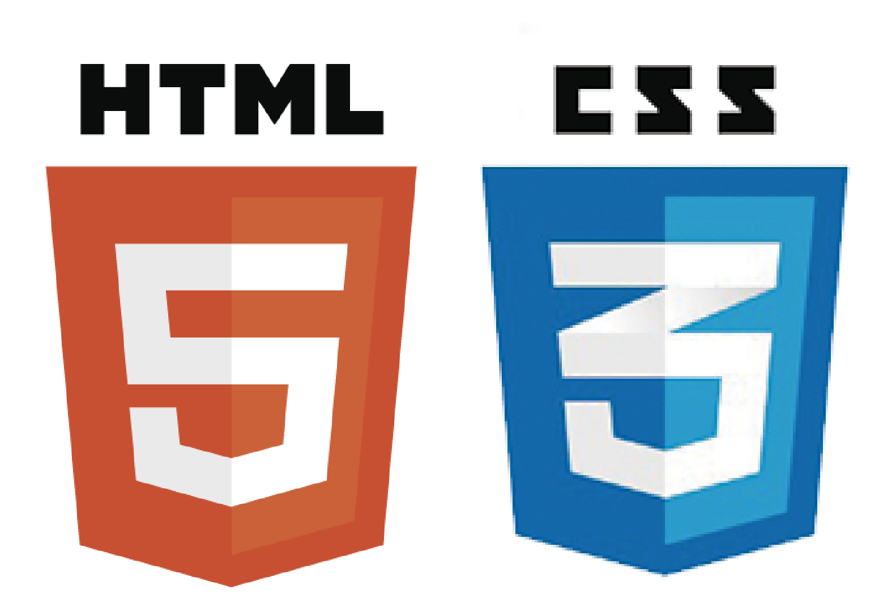

# HTML5 & CSS3 Playground [](https://travis-ci.org/pedrovgs/HTML5-CSS3-Playground)

HTML5 & CSS3 Playground created just for learning purposes :smiley:



# Playing in this playground

As this repository is thought to just learn something about HTML5 & CSS3 we've configured [yarn](https://yarnpkg.com/en/) and added some nice development dependencies to be able to make our life easier when writing some code. **If you want to just start a HTTP server showing the content of this page in your default browser you just need to execute:**

```
yarn start
```

This command will create a simple HTTP server using the ``src`` folder as the root path. Under the hood this command is using **[live-server](https://github.com/tapio/live-server) to refresh your browser everytime you change part of the HTML or CSS code** so you don't have to press CMD+R after every change :smiley:

## Style lint

As this repository contains just HTML5 and CSS3 code we decided to add a powerful linter named [Stylelint](https://github.com/stylelint/stylelint) you can easily run by executing the following commands:

```
yarn lintCSS # Checks if the CSS code contains any lint error.
yarn lintHTML # Checks if the HTML code contains any lint error.
yarn lint # Checks if the CSS or the HTML code contains any lint error.
```

The linter configuration can be found in the file named ``.stylelintrc``. It's simple extension of the [stylelint-config-standard](https://github.com/stylelint/stylelint-config-standard) configuration.

Developed By
------------

* Pedro Vicente Gómez Sánchez - <pedrovicente.gomez@gmail.com>

<a href="https://twitter.com/pedro_g_s">
  
</a>
<a href="https://es.linkedin.com/in/pedrovgs">
  
</a>

License
-------

    Copyright 2018 Pedro Vicente Gómez Sánchez

    Licensed under the GNU General Public License, Version 3 (the "License");
    you may not use this file except in compliance with the License.
    You may obtain a copy of the License at

        http://www.gnu.org/licenses/gpl-3.0.en.html

    Unless required by applicable law or agreed to in writing, software
    distributed under the License is distributed on an "AS IS" BASIS,
    WITHOUT WARRANTIES OR CONDITIONS OF ANY KIND, either express or implied.
    See the License for the specific language governing permissions and
    limitations under the License.
